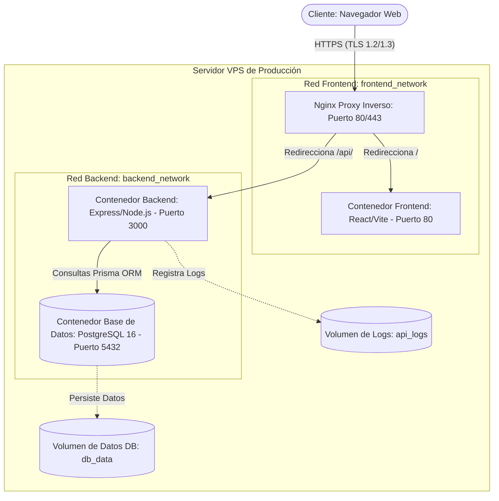

# 📘 Manual de Despliegue y Guía Técnica de Producción
## Gestor Financiero Automatizado — Versión 1.0.0

Este documento contiene la guía técnica y los procedimientos de despliegue necesarios para llevar el **Gestor Financiero Automatizado** a un entorno de producción seguro, estable y escalable.

---

## 📑 Tabla de Contenidos
1. [Descripción y Arquitectura del Sistema](#1-descripción-y-arquitectura-del-sistema)
2. [Requisitos Previos del Servidor (VPS)](#2-requisitos-previos-del-servidor-vps)
3. [Configuración de Variables de Entorno (`.env`)](#3-configuración-de-variables-de-entorno-env)
4. [Estrategia de Contenedores y Redes Docker](#4-estrategia-de-contenedores-y-redes-docker)
5. [Guía de Despliegue Paso a Paso en VPS](#5-guía-de-despliegue-paso-a-paso-en-vps)
6. [Seguridad y Hardening en Producción](#6-seguridad-y-hardening-en-producción)
7. [Base de Datos: Migraciones, Backups y Restauración](#7-base-de-datos-migraciones-backups-y-restauración)
8. [Monitoreo y Mantenimiento Continuo](#8-monitoreo-y-mantenimiento-continuo)
9. [Resolución de Problemas Comunes (Troubleshooting)](#9-resolución-de-problemas-comunes-troubleshooting)

---

## 1. Descripción y Arquitectura del Sistema

El **Gestor Financiero Automatizado** es una aplicación Web Full-Stack de control de caja, ingresos, egresos y control de personal, estructurada bajo una arquitectura de microservicios contenerizados y aislados.

### Diagrama de Arquitectura de Producción



### Componentes de la Arquitectura:

1. **Proxy Inverso (`gestor_proxy`)**: Contenedor Nginx que actúa como el único punto de entrada público. Maneja la terminación de SSL/TLS (Let's Encrypt), aplica políticas de compresión gzip, cabeceras de seguridad HTTP y limita la tasa de peticiones (Rate Limiting) para mitigar ataques DDoS y de fuerza bruta.
2. **Frontend (`gestor_frontend`)**: Aplicación React compilada estáticamente y servida internamente por un Nginx optimizado con políticas de caché a largo plazo para assets inmutables.
3. **Backend API (`gestor_api`)**: Servicio en Express (Node.js) ejecutándose en un contenedor con privilegios reducidos (usuario `expressjs`), encargado de resolver las reglas de negocio, autorizaciones por rol/permiso y transacciones financieras.
4. **Base de Datos (`gestor_db`)**: Instancia de PostgreSQL 16. No expone puertos al exterior; está completamente aislada en la red interna de backend y solo se comunica con la API.

---

## 2. Requisitos Previos del Servidor (VPS)

Para garantizar un rendimiento óptimo de la aplicación en producción, se recomiendan los siguientes requerimientos de infraestructura mínimos:

*   **Proveedor**: DigitalOcean, Linode, AWS EC2, GCP Compute Engine, Hetzner, etc.
*   **Sistema Operativo**: Ubuntu Server 22.04 LTS o superior.
*   **Especificaciones Mínimas**:
    *   **CPU**: 1 vCPU (se recomienda 2 vCPUs para compilaciones en caliente).
    *   **Memoria RAM**: 1.5 GB de RAM mínimo (o 1 GB con una partición Swap de al menos 1 GB configurada).
    *   **Almacenamiento**: 15 GB SSD o NVMe libres.
*   **Red**: Dirección IP pública estática IPv4.
*   **Dominio**: Un dominio o subdominio apuntando mediante un registro `A` a la IP pública del VPS (ej: `app.minegocio.com`).

---

## 3. Configuración de Variables de Entorno (`.env`)

El archivo `.env` en la raíz del proyecto controla el comportamiento del backend y los argumentos de compilación del frontend. En producción, **nunca se deben usar valores por defecto**.

### Tabla de Variables de Entorno Requeridas:

| Variable | Tipo / Formato | Propósito en Producción | Ejemplo / Recomendación |
| :--- | :--- | :--- | :--- |
| `NODE_ENV` | `production` | Activa optimizaciones de producción de Express y dependencias. | `production` |
| `PORT` | Número | Puerto interno donde corre el backend dentro del contenedor. | `3000` |
| `DATABASE_URL` | URL de conexión | Cadena de conexión JDBC/PostgreSQL para Prisma. | `postgresql://gestor_user:SECRETO_DB@db_service:5432/gestor_financiero?schema=public` |
| `POSTGRES_DB` | String | Nombre de la base de datos de Postgres en el contenedor. | `gestor_financiero` |
| `POSTGRES_USER` | String | Usuario de base de datos con permisos sobre el esquema. | `gestor_user` |
| `POSTGRES_PASSWORD`| String | Contraseña segura para el usuario administrador de PostgreSQL. | *Generar con openssl (mínimo 24 caracteres)* |
| `JWT_SECRET` | String | Clave criptográfica para firmar Access Tokens (JWT). | *Generar con openssl (mínimo 64 caracteres)* |
| `JWT_EXPIRES_IN` | Duración | Tiempo de expiración del token de acceso (se recomienda corto). | `15m` |
| `REFRESH_SECRET` | String | Clave criptográfica para firmar Refresh Tokens. | *Generar con openssl (mínimo 64 caracteres)* |
| `REFRESH_EXPIRES_IN`| Duración | Tiempo de expiración del Refresh Token persistido. | `30d` |
| `BCRYPT_ROUNDS` | Número (10-14) | Factor de costo para hash de contraseñas (12 es el balance óptimo). | `12` |
| `CORS_ORIGIN` | URL válida | Dominio público del sitio. Nginx proxy restringe el origen CORS. | `https://app.minegocio.com` |
| `LOG_LEVEL` | String | Nivel mínimo de logs registrados por Winston. | `info` (o `error` para menor verbosidad) |
| `VITE_API_URL` | URL de API | URL pública de la API que consume el navegador. | `https://app.minegocio.com/api` |

### Script para Generar Contraseñas y Secrets de Producción:

Ejecuta el siguiente comando en una terminal para generar valores aleatorios seguros de forma instantánea:

```bash
# Generar POSTGRES_PASSWORD
openssl rand -base64 24

# Generar JWT_SECRET
openssl rand -hex 64

# Generar REFRESH_SECRET
openssl rand -hex 64
```

> [!IMPORTANT]
> El archivo `.env` resultante contiene credenciales altamente sensibles. Nunca se debe versionar en Git. Asegúrate de que sus permisos de lectura estén limitados únicamente al usuario de ejecución (`chmod 600 .env`).

---

## 4. Estrategia de Contenedores y Redes Docker

El despliegue utiliza `docker-compose.yml` para aislar los microservicios mediante subredes virtuales creadas por el driver de red bridge de Docker.

### Segmentación de Red:
1.  **`backend_network` (Red Privada)**:
    *   Conecta únicamente `db_service`, `api_service` y `proxy_service`.
    *   La base de datos `db_service` **no** tiene mapeado ningún puerto al exterior del VPS. No tiene acceso directo a Internet ni es visible desde el frontend.
2.  **`frontend_network` (Red Pública/Front)**:
    *   Conecta `frontend_service` y `proxy_service`.
    *   Permite al proxy resolver el código estático y pasar peticiones a la API.

### Volúmenes de Persistencia de Datos:
*   **`db_data`**: Volumen mapeado a `/var/lib/postgresql/data`. Asegura la persistencia de la base de datos de PostgreSQL al reiniciar o actualizar contenedores.
*   **`api_logs`**: Volumen mapeado a `/app/logs`. Almacena los archivos de logs de Winston generados por el backend en el disco del host para auditoría externa y recolección de logs.
*   **`certbot_webroot`**: Directorio intermedio utilizado para renovaciones automáticas de certificados SSL con Certbot mediante HTTP ACME validation.

---

## 5. Guía de Despliegue Paso a Paso en VPS

### Paso 1: Configurar el Firewall y Sistema Operativo del Servidor
Conéctate por SSH a tu servidor y actualiza los paquetes básicos:

```bash
ssh root@IP_DE_TU_SERVIDOR
apt update && apt upgrade -y
```

Configura el Firewall Unificado (`ufw`) para proteger puertos sensibles:

```bash
# Permitir conexiones SSH necesarias para no perder el acceso
ufw allow 22/tcp

# Permitir HTTP y HTTPS públicos
ufw allow 80/tcp
ufw allow 443/tcp

# Denegar por defecto todo el resto del tráfico entrante
ufw default deny incoming
ufw default allow outgoing

# Habilitar firewall
ufw enable
```

### Paso 2: Instalar Docker y Docker Compose
Ejecuta el script oficial de instalación de Docker:

```bash
curl -fsSL https://get.docker.com -o get-docker.sh
sudo sh get-docker.sh
```

Instala la última versión estable de Docker Compose:

```bash
sudo apt install docker-compose-plugin -y
# Verificar instalación
docker compose version
```

### Paso 3: Crear un Usuario de Ejecución de Aplicaciones
Por razones de seguridad de infraestructura, nunca debes correr Docker Compose como `root`. Crea un usuario de sistema dedicado:

```bash
# Crear el usuario "gestor"
sudo useradd -m -s /bin/bash gestor
# Agregar el usuario al grupo Docker para poder controlar contenedores
sudo usermod -aG docker gestor
```

### Paso 4: Configurar los Certificados SSL (Let's Encrypt)
Antes de iniciar los servicios de Nginx, debes obtener un certificado SSL válido. Tienes dos métodos recomendados:

#### Método A: Standalone (Inicial / Recomendado para Bootstrap)
Este método levanta un servidor temporal independiente para validar el dominio antes de levantar Nginx.
```bash
# Instalar Certbot
sudo apt install certbot -y

# Asegurar que el puerto 80 no esté en uso por otro proceso
# Generar el certificado para tu dominio
sudo certbot certonly --standalone \
  -d app.minegocio.com \
  --email admin@minegocio.com \
  --agree-tos --no-eff-email
```

Los certificados se generarán y guardarán automáticamente en la ruta `/etc/letsencrypt/live/app.minegocio.com/`.

#### Método B: Webroot (Para renovación o si Nginx ya está activo con certificados autofirmados)
Este método utiliza el contenedor Nginx en ejecución y el volumen compartido para verificar la propiedad del dominio a través de la carpeta `certbot_webroot` sin detener el servidor web:
```bash
# Ejecutar certbot indicando el directorio del webroot del Nginx
sudo certbot certonly --webroot -w /var/www/certbot \
  -d app.minegocio.com \
  --email admin@minegocio.com \
  --agree-tos --no-eff-email
```

### Paso 5: Preparar el Código en el Servidor
Cambia al usuario `gestor` y clona el repositorio del proyecto:

```bash
su - gestor
cd ~
git clone https://github.com/max9lh/ecommerce-project.git app
cd app
```

Copia el archivo de configuración de variables de entorno y complétalo con tus secrets:

```bash
cp .env.example .env
nano .env
```

> [!TIP]
> **Configuración del Correo para Recuperación de Contraseñas (Opcional)**
> Si deseas habilitar el sistema de restablecimiento de contraseñas por email:
> 1. Completa las variables `SMTP_HOST`, `SMTP_PORT`, `SMTP_SECURE`, `SMTP_USER`, `SMTP_PASS` y `SMTP_FROM` en tu archivo `.env`.
> 2. Edita el archivo `backend/src/config/mailer.js` para instalar `nodemailer` (`npm install nodemailer`) y descomentar las líneas del transporte SMTP y del envío del mail.


### Paso 6: Configurar Nginx para Producción con SSL Real
Edita el archivo `nginx/nginx.conf` del repositorio. Modifica la configuración para descomentar las líneas de Let's Encrypt y cambiar el dominio de ejemplo por el tuyo:

```nginx
# Dentro de nginx/nginx.conf en el bloque del servidor HTTPS (443):

# ---- Certificados SSL Reales ----
ssl_certificate     /etc/letsencrypt/live/app.minegocio.com/fullchain.pem;
ssl_certificate_key /etc/letsencrypt/live/app.minegocio.com/privkey.pem;

# Comenta o elimina la sección de certificados temporales autofirmados:
# ssl_certificate     /etc/nginx/ssl/self-signed.crt;
# ssl_certificate_key /etc/nginx/ssl/self-signed.key;
```

Para asegurar que Nginx en el contenedor pueda leer los certificados de Let's Encrypt del host, debemos mapear la carpeta `/etc/letsencrypt` en el archivo `docker-compose.yml`. Edita `docker-compose.yml` en la sección del `proxy_service` bajo `volumes`:

```yaml
    volumes:
      - ./nginx/nginx.conf:/etc/nginx/conf.d/default.conf:ro
      - /etc/letsencrypt:/etc/letsencrypt:ro
      - certbot_webroot:/var/www/certbot:ro
```

### Paso 7: Compilar y Levantar el Stack Completo
Compila las imágenes Docker multi-stage y levanta los servicios en segundo plano (`detached mode`):

```bash
docker compose build
docker compose up -d
```

Verifica que todos los contenedores estén levantados y reportando un estado saludable (`healthy`):

```bash
docker compose ps
```

---

## 6. Seguridad y Hardening en Producción

### 🔒 Cabeceras HTTP de Seguridad
Nginx está preconfigurado en `nginx/nginx.conf` para inyectar cabeceras HTTP restrictivas:
*   `Strict-Transport-Security` (HSTS): Obliga al navegador a comunicarse exclusivamente mediante HTTPS durante dos años (`max-age=63072000`).
*   `X-Frame-Options: DENY`: Previene ataques de Clickjacking evitando que el sitio sea renderizado dentro de un iframe.
*   `X-Content-Type-Options: nosniff`: Evita que el navegador interprete archivos con tipos MIME incorrectos.
*   `Content-Security-Policy` (CSP): Restringe de dónde se pueden descargar estilos, scripts y fuentes, previniendo inyección de código XSS.

### 🛡️ Rate Limiting en el Proxy e Instancia
El proxy inversa define políticas de rate limiting mediante la directiva `limit_req_zone`:
*   **API General (`api_limit`)**: Límite de 30 solicitudes por minuto por dirección IP, con ráfagas máximas de hasta 20 conexiones.
*   **Autenticación (`auth_limit`)**: Límite estricto de 5 solicitudes por minuto en `/api/auth/` para impedir bruteforce de credenciales.

### 👥 Usuario de Aplicación de Privilegios Reducidos
El backend utiliza un contenedor Docker basado en Node.js configurado con una política de seguridad interna:
*   No ejecuta comandos como `root`.
*   El Dockerfile crea el usuario `expressjs` en el grupo `nodejs`.
*   Toda la ejecución de dependencias, scripts de Prisma e inicio del servidor web ocurre bajo los privilegios reducidos de este usuario, bloqueando escaladas de privilegios en el host si hubiese una brecha de seguridad.

### 📜 Rotación de Logs
El framework de logging Winston en el backend (`backend/src/config/logger.js`) está pre-configurado para evitar llenar el espacio en disco:
*   Guarda logs en formato JSON separados en carpetas de `logs/error.log` y `logs/combined.log`.
*   Los logs rotan diariamente utilizando la librería `winston-daily-rotate-file`.
*   Se retienen los logs por un máximo de **14 días**, borrando los más antiguos automáticamente.

---

## 7. Base de Datos: Migraciones, Backups y Restauración

### Migraciones Automatizadas
Durante el inicio del contenedor del backend (`api_service`), se ejecuta automáticamente el comando `npx prisma migrate deploy`. Este comando:
1.  Compara la base de datos de producción con el historial de migraciones en `/prisma/migrations/`.
2.  Aplica únicamente las migraciones pendientes de forma atómica.
3.  Si ocurre un fallo, detiene el despliegue del contenedor para proteger la integridad de los datos.

### 💾 Automatización de Backups Diarios (Script Cron)
Para proteger la información financiera de fallos de hardware o corrupción del sistema, configura copias de seguridad automáticas en el host del VPS.

Crea un script de respaldo en `/home/gestor/backups/backup_db.sh`:

```bash
#!/bin/bash
# ============================================================
# Script: Respaldo Diario Automatizado de PostgreSQL en Docker
# Mantiene copias locales y elimina archivos con más de 30 días
# ============================================================

BACKUP_DIR="/home/gestor/backups/files"
DB_CONTAINER="gestor_db"
DB_USER="gestor_user"
DB_NAME="gestor_financiero"
DATE=$(date +%Y-%m-%d_%H%M%S)
FILENAME="$BACKUP_DIR/backup_${DB_NAME}_${DATE}.sql.gz"

# Crear directorio si no existe
mkdir -p "$BACKUP_DIR"

echo "💾 Iniciando respaldo de base de datos..."
docker exec -t $DB_CONTAINER pg_dump -U $DB_USER -d $DB_NAME | gzip > "$FILENAME"

if [ $? -eq 0 ]; then
  echo "✅ Respaldo exitoso: $FILENAME"
else
  echo "❌ Error al generar el respaldo de la base de datos"
  exit 1
fi

# Eliminar respaldos más viejos a 30 días para evitar saturar el disco
find "$BACKUP_DIR" -type f -name "*.sql.gz" -mtime +30 -exec rm {} \;
echo "🧹 Limpieza de respaldos antiguos completada."
```

Asigna permisos de ejecución al script:

```bash
chmod +x /home/gestor/backups/backup_db.sh
```

Configura una tarea programada (`cron`) ejecutando `crontab -e` con el usuario `gestor` para respaldar la base de datos todas las noches a las 02:00 AM:

```cron
0 2 * * * /home/gestor/backups/backup_db.sh >> /home/gestor/backups/cron.log 2>&1
```

### 🔄 Proceso de Restauración de la Base de Datos
En caso de desastre, puedes restaurar la base de datos a partir de una copia de seguridad comprimida `.sql.gz`:

```bash
# 1. Descomprimir el respaldo seleccionado
gunzip -k /home/gestor/backups/files/backup_gestor_financiero_2026-06-03_020000.sql.gz

# 2. Restaurar el archivo SQL dentro del contenedor Docker de Postgres
# IMPORTANTE: Esto sobrescribirá las tablas existentes en la DB
docker exec -i gestor_db psql -U gestor_user -d gestor_financiero < /home/gestor/backups/files/backup_gestor_financiero_2026-06-03_0### Renovación Automática de Certificados SSL (Cero Caída)
Dado que Nginx ya tiene preconfigurado el volumen `certbot_webroot` mapeado a `/var/www/certbot`, podemos renovar los certificados sin detener el proxy (evitando caídas de servicio).

Configura la renovación automática quincenal en el `crontab` de `root`:

```bash
# Abrir crontab de root
sudo crontab -e
```

Añade la siguiente regla para renovar a través del Webroot y recargar Nginx automáticamente para que lea las nuevas llaves:

```cron
0 3 1,15 * * certbot renew --webroot -w /var/www/certbot --post-hook "docker compose -f /home/gestor/app/docker-compose.yml exec -T proxy_service nginx -s reload" >> /var/log/certbot-renew.log 2>&1
```

### Comandos de Mantenimiento Comunes:

*   **Verificar el consumo de recursos de los contenedores en tiempo real**:
    ```bash
    docker stats
    ```
*   **Inspeccionar los logs de la API en producción**:
    ```bash
    # Filtrar últimas 100 líneas y seguir en vivo
    docker compose logs -f --tail=100 api_service
    ```
*   **Reiniciar un servicio específico sin tirar el resto del stack**:
    ```bash
    docker compose restart api_service
    ```
*   **Limpiar imágenes huérfanas y cachés de Docker para recuperar espacio en disco**:
    ```bash
    docker system prune -a --volumes -y
    ```

---

## 9. Despliegue Alternativo en Vercel (Monorrepósito)

El proyecto cuenta con un archivo `vercel.json` en la raíz que permite su despliegue completo en la plataforma de Vercel como un proyecto serverless único.

### Configuración del Ruteo en Vercel
El archivo `vercel.json` de la raíz redirige las peticiones de la siguiente manera:
- Peticiones del frontend (`/`): Mapeadas a la carpeta `/frontend` usando el framework Vite.
- Peticiones del backend (`/_/backend`): Mapeadas a la carpeta `/backend` ejecutándose en funciones serverless.

### Configuración de Variables de Entorno en Vercel Dashboard
Deberá registrar las siguientes variables de entorno en el panel de Vercel:
*   `DATABASE_URL`: URL de conexión PostgreSQL pública.
*   `JWT_SECRET`: Llave de encriptación de firma de tokens (mínimo 32 caracteres).
*   `REFRESH_SECRET`: Llave de encriptación de firma de refresh tokens (mínimo 32 caracteres).
*   `BCRYPT_ROUNDS`: `10` (recomendado en entornos serverless para reducir el uso de CPU/tiempo de respuesta).

> [!WARNING]
> **Agotamiento de Conexiones a Base de Datos (Serverless Connection Pooling)**
> Las funciones serverless de Vercel escalan horizontalmente y no comparten el pool de conexiones de base de datos como lo hace el contenedor Docker tradicional. 
> Para producción en Vercel, es **crítico** usar un pooler de conexiones (como **Prisma Accelerate**, **PgBouncer**, o el pooler transaccional de **Supabase** en el puerto `6543`), de lo contrario la base de datos se saturará rápidamente con errores `Too many connections`.

---

## 10. Pipeline de Integración y Despliegue Continuo (CI/CD Básico)

Para automatizar las actualizaciones en producción cada vez que se hace un `git push` a la rama `main`, puede crear un script simple en el VPS que sea gatillado por un Webhook de GitHub, o usar una GitHub Action básica:

### Script de Despliegue Automatizado (`deploy.sh`)
Crea un script en `/home/gestor/app/deploy.sh` con los siguientes pasos:

```bash
#!/bin/bash
# ============================================================
# Script: Actualización continua automatizada de la app
# ============================================================
cd /home/gestor/app

# Traer últimos cambios de producción
git pull origin main

# Recompilar y reiniciar contenedores con el mínimo downtime
docker compose up -d --build --remove-orphans

# Limpiar cache de compilaciones antiguas de Docker
docker system prune -f
```

---

## 11. Resolución de Problemas Comunes (Troubleshooting)

### Problema 1: El contenedor de la API falla al iniciar con `validate-env` error
*   **Causa**: Falta alguna variable de entorno obligatoria en tu archivo `.env` o el valor no cumple con la validación de tipo/esquema definida en `backend/src/config/validate-env.js`.
*   **Solución**: Ejecuta `docker compose logs api_service` para ver el error de validación de Zod exacto. Compara los nombres del `.env` con el esquema de validación y corrige los valores faltantes.

### Problema 2: Error `Database is not accepting connections` o fallos en migraciones Prisma
*   **Causa**: El contenedor de la base de datos no se ha inicializado a tiempo o tiene credenciales erróneas.
*   **Solución**:
    1. Revisa los logs de la base de datos con `docker compose logs db_service`.
    2. Asegúrate de que `POSTGRES_PASSWORD` en el `.env` coincida exactamente con la contraseña inyectada en `DATABASE_URL`.
    3. Si es la primera vez que se monta, PostgreSQL puede tardar unos segundos extras en ejecutar el script de inicialización de triggers `init.sql`. Reinicia la API con `docker compose restart api_service`.

### Problema 3: Error de CORS en el navegador al consultar recursos
*   **Causa**: La variable `CORS_ORIGIN` del backend no coincide con el dominio real desde el cual estás accediendo.
*   **Solución**: Verifica el valor de `CORS_ORIGIN` en el `.env`. Debe incluir el protocolo y el dominio exacto sin barra final (ej: `https://app.minegocio.com`). Reinicia la API tras realizar el cambio.

---
*Manual técnico redactado y verificado para la puesta en marcha segura del Gestor Financiero.*
*Versión de documentación: 1.0.0. Actualización: Junio de 2026.*
